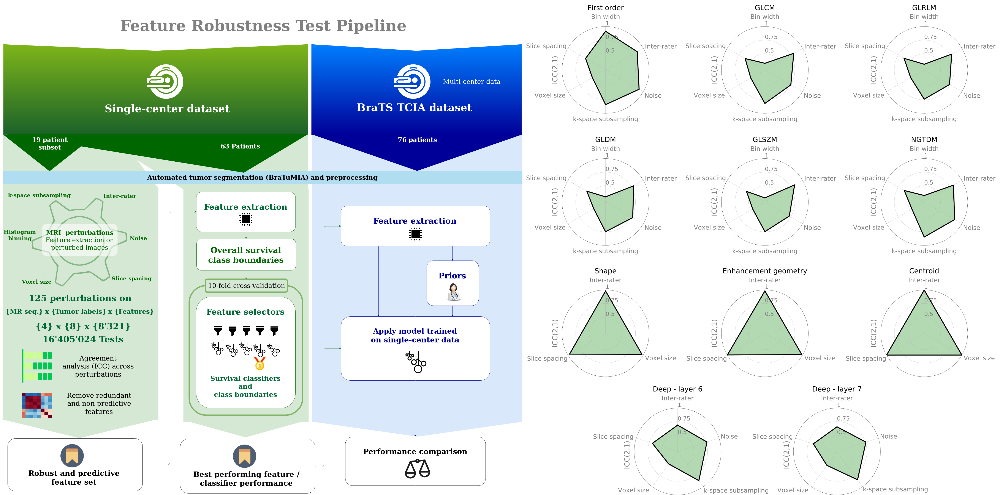

This repository contains the code and further information for the paper 

## Radiomics for glioblastoma survival analysis in pre-operative MRI: exploring feature robustness, class boundaries, and machine learning techniques

> Suter, Y., Knecht, U., Alão, M. *et al.* Radiomics for glioblastoma survival analysis in pre-operative MRI: exploring feature robustness,  class boundaries, and machine learning techniques. *Cancer Imaging* **20,** 55 (2020). https://doi.org/10.1186/s40644-020-00329-8

If you are working with radiomics on both single- and multi-center data, we recommend testing the robustness of the features used against perturbations to be expected on the target dataset.

Please refer to the main document and supplementary material for full references. This repository only contains additional information and details on the tools used to facilitate reproducibility.

Please note that the perturbations and perturbation strengths should be tailored to your imaging modality, dataset and are disease-specific.

### Preprocessing

The scripts used are contained in the corresponding folder. Bias field correction was performed using the `N4BiasFieldCorrectionImageFilter` from `SimpleITK`. We used `mri_robust_register`for atlas registration.

### Image Perturbations

- Voxel size and slice spacing: These two perturbations were directly applied in the feature extraction step, through setting the parameter `resampledPixelSpacing` accordingly in the PyRadiomics settings `yaml`file
- Inter-rater variabiliy: B-spline transform of the segmentation labels. Tune carefully to match the desired inter-rater variability.
- K-space subsampling: Random subsampling is applied in the k-space. For a more realistic output, a more sophisticated sampling scheme could be implemented
- Histogram binning: As for the voxel size and slice spacing, the number of bins were controlled through the PyRadiomics settings
- Noise: Different levels of additive Gaussian noise were added. Please set the minimum SNR for your dataset accordingly.

### Features

- PyRadiomics features were extracted using version 2.2.0.
- The enhancement geometry features were calculated based on the description in the cited paper. These were not directly calculated on the segmentation label maps, but derived from the PyRadiomics shape features.
- The deep features were calculated based on the paper by Lao et al.

### Robustness Testing

The robustness of the radiomic features was assessed using the intraclass correlation coefficient ICC(2,1), using the `rpsych` R-package through `rpy2`.

### Feature Selection and Classifier Comparison

The different feature selection method and ML techniques were evaluated by testing all combinations in ugly nested loops. Please pardon the ugly "research code".

The selected feature names are saved in CSV files for inspection.

### Robustness an Concordance index data

We provide two CSV files in the robustness data folder:

- If you are interested in the ICC(2,1) values for each feature group, have a look at `ICC_featuregroups.csv` This is the raw data used to make the robustness radar plot
- The concordance indices for all 223602 features are listed in the file `features_concordanceindex.csv`. Please note that these values were calculated on the single-center data and not on the BraTS data.

### Support

Please let us know through opening an issue in this repository if you miss some information or code.
